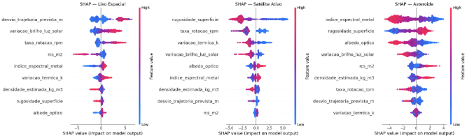

# Previsão de Objetos no Espaço

## Contexto do Problema

É previsto que existam hoje aproximadamente 130 milhões de detritos na órbita terrestre. Esses objetos variam desde pequenos parafusos à satélites inativos viajando a velocidades que chegam a milhares de kilômetros por segundo, o que os torna capazes de destruir satélites operacionais e naves. A síndrome de Kessler, é um cenário em que colisões do espaço geram mais fragmentos, criando um efeito dominó incontrolável que poderia inutilizar órbitas inteiras ao redor da Terra. Essa situação é um perigo real tanto para as telecomunicações na terra quanto para as missões que estão em curso.

Nossa solução se baseia em detectar e classificar objetos orbitais, que podem ser **lixo espacial**, **satélites ativos** ou **asteroides (incluindo meteoritos)**. A classificação incorreta ou lenta desses objetos representa um risco operacional: lixo espacial não rastreado pode colidir com satélites ativos, e a demora para sua detecção diminui o tempo de reação para ações como o acionamento de propulsores de satélites e naves com a intenção realizar uma manobra de desvio de lixos espaciais que podem estar vindo na rota de colisão.

Este projeto propõe um modelo de machine learning capaz de classificar automaticamente objetos detectados no espaço a partir de características físicas e espectrais, com o objetivo de apoiar decisões operacionais com maior agilidade e precisão.

---

## Fonte dos Dados

Os dados foram gerados de forma sintética utilizando inteligência artificial generativa, simulando características físicas e instrumentais de objetos espaciais reais. O dataset contém **5.000 amostras** distribuídas em três classes:

| Classe | Descrição | Proporção |
|--------|-----------|-----------|
| 0 | Lixo Espacial | 55% |
| 1 | Satélite Ativo | 15% |
| 2 | Asteroide | 30% |

As features incluem medições simuladas de radar, espectroscopia óptica, temperatura superficial, rotação e densidade, com ruído de sensor de 5% e 1,5% de outliers para simular falhas instrumentais reais.


---

## Metodologia Utilizada

1. **Geração e pré-processamento dos dados** — dataset sintético com distribuições sobrepostas entre classes para maior realismo, ruído gaussiano e outliers aleatórios
2. **Divisão treino/teste** — 70/30 para XGBoost e 80/20 para MLP
3. **Normalização** — `StandardScaler` aplicado exclusivamente no MLP (XGBoost não requer normalização por ser baseado em árvores)
4. **Treinamento e avaliação** — acurácia, precision, recall, F1-score e matriz de confusão por classe
5. **Explicabilidade** — SHAP (`TreeExplainer`) para interpretar as decisões do XGBoost por classe
6. **Deploy** — interface interativa com Gradio para predição em tempo real

---

## Modelos Testados

### XGBoost Classifier
- `n_estimators`: 502
- `max_depth`: 4
- `learning_rate`: 0.1
- Normalização: **não necessária**

### MLP Classifier (Rede Neural)
- Arquitetura: 2 camadas ocultas (100 → 56 neurônios)
- Função de ativação: ReLU
- `max_iter`: 500
- Normalização: **obrigatória** via `StandardScaler`

---

## Resultados Obtidos

### Acurácia Geral

| Modelo | Acurácia |
|--------|----------|
| XGBoost | **96.4%** |
| MLP | 95.4% |

### Classification Report — MLP

| Classe | Precision | Recall | F1-Score | Support |
|--------|-----------|--------|----------|---------|
| Lixo Espacial | 0.95 | 0.96 | 0.96 | 526 |
| Satélite Ativo | 0.98 | 0.97 | 0.98 | 167 |
| Asteroide | 0.94 | 0.93 | 0.94 | 307 |
| **Macro avg** | **0.96** | **0.95** | **0.96** | 1000 |
| **Weighted avg** | **0.95** | **0.95** | **0.95** | 1000 |

### Principais observações

- O maior erro de ambos os modelos ocorre na fronteira **Asteroide ↔ Lixo Espacial** — objetos não controlados com física similar
- **Satélite Ativo** apresenta o melhor F1 (0.98) mesmo sendo a classe minoritária, graças à `taxa_rotacao_rpm` baixa como sinal discriminante
- O erro mais crítico operacionalmente é **Asteroide classificado como Lixo Espacial** (22 casos no MLP): objetos que deveriam receber monitoramento de trajetória sendo ignorados

### Modelo recomendado: XGBoost

O XGBoost é mais adequado para este problema por:
- Maior acurácia (+1 pp)
- Resistência nativa a outliers de sensor
- Explicabilidade via SHAP sem custo computacional adicional
- Deploy mais simples (sem necessidade de salvar e aplicar `StandardScaler`)

---

## Interpretação com SHAP

O SHAP (`TreeExplainer`) foi utilizado para explicar as decisões do XGBoost por classe:

<div align="center">
 
</div>

### Interpretação por classe

- **Lixo Espacial** — identificado principalmente por alta `taxa_rotacao_rpm` (rotação caótica) e alta `variacao_brilho_luz_solar` (pisca ao girar)
- **Satélite Ativo** — distinguido pela combinação de `taxa_rotacao_rpm` próxima de zero (estabilização ativa) e baixa `rugosidade_superficie`
- **Asteroide** — separado pelos valores baixos de `indice_espectral_metal` e alta `rugosidade_superficie`, refletindo composição rochosa natural

### Feature Importance Global

| Posição | Feature | Importância |
|---------|---------|-------------|
| 1° | `indice_espectral_metal` | 21.7% |
| 2° | `rugosidade_superficie` | 18.1% |
| 3° | `taxa_rotacao_rpm` | 17.4% |
| 4° | `variacao_brilho_luz_solar` | 15.4% |
| 5° | `desvio_trajetoria_prevista_m` | 11.3% |
| 6° | `rcs_m2` | 7.1% |
| 7° | `albedo_optico` | 4.2% |
| 8° | `variacao_termica_k` | 3.1% |
| 9° | `densidade_estimada_kg_m3` | 1.7% |


A distribuição equilibrada das importâncias (nenhuma feature acima de 22%) indica que o modelo aprende padrões multivariados, sem dependência excessiva de uma única variável.

---

## Instruções para Execução do Projeto

### Pré-requisitos

- Python 3.9+
- Ambiente virtual recomendado

### Instalação

```bash
# Clone o repositório
git clone https://github.com/vvctort1/space_object_predict.git
cd space_object_predict

# Crie e ative o ambiente virtual
python -m venv venv
source venv/bin/activate  # Linux/macOS
venv\Scripts\activate     # Windows

# Instale as dependências
pip install -r requirements.txt
```

### Estrutura do projeto

```

├── src/
│   │
│   ├── data/   
│   │   └── objetos_espaciais_complexo.csv
│   │
│   ├── img/   
│   │   ├── deploy.png
│   │   ├── feature_importance_xgboost.png
│   │   ├── matrix_confusao.mlp.png
│   │   └── shap.png
│   │
│   ├── models/   
│   │   └── modelo_xgb.joblib         # Modelo XGBoost treinado 
│   │
│   └── notebooks/
│      └── objetos_espaciais.ipynb
│
├── app.py              # Código utilizado no deploy
├── requirements.txt.    # Dependências do projeto
└── README.md

```

### Executando o notebook

```bash
jupyter notebook src/notebooks/objetos_espaciais.ipynb
```


## Link da Aplicação

Para abrir o deploy da aplicação clique <a href="https://huggingface.co/spaces/vvctort1/detector_lixo_espacial">aqui</a>.

---

## Integrantes do Grupo

| Nome | RM |
|------|----|
| Victor Kenzo Toma | RM551649 |
| Arthur Baldissera Claumann Marcos | RM550219 |
| Ricardo Ramos Vergani | RM550166 |
